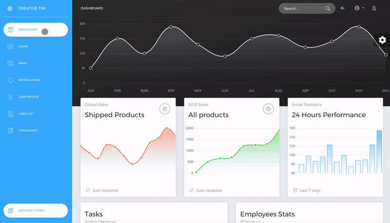

# [Now UI Dashboard React](https://demos.creative-tim.com/now-ui-dashboard-react/#/dashboard) [](https://twitter.com/intent/tweet?url=https%3A%2F%2Fdemos.creative-tim.com%2Fnow-ui-dashboard-react%2F%23%2Fdashboard&text=Now%20UI%20Dashboard%20React%20by%20Creative%20Tim%20%7C%20Free%20React%20Admin%20Template&original_referer=http%3A%2F%2Flocalhost%3A3000%2Fdashboard&via=creativetim&hashtags=react%2Cbootstrap)


  []() []() [](https://discord.gg/E4aHAQy)



该项目是基于 **[Now UI Dashboard React](https://creativetimofficial.github.io/now-ui-dashboard-react/#/dashboard)** 使用electron扩展问桌面应用，增加了ref及ffi组件，扩展了对dll程序调用。

It comes with 6 filter colors for the sidebar (`black`, `blue`, `green`, `orange`, `red`, `yellow`) and an option to have a background image.

## Table of Contents

* [Versions](#versions)
* [Demo](#demo)
* [Quick Start](#快速开始)
* [Documentation](#文档)
* [File Structure](#文件结构)


## Versions
[](https://www.creative-tim.com/product/now-ui-dashboard-react)


| [](https://www.creative-tim.com/product/now-ui-dashboard) | [](https://www.creative-tim.com/product/now-ui-dashboard-react) | [](https://www.creative-tim.com/product/now-ui-dashboard-angular2)

## Demo

| Dashboard | User Profile | Tables | Maps | Notification |
| --- | --- | --- | --- | --- |
| [](https://demos.creative-tim.com/now-ui-dashboard-react/#/dashboard) | [](https://demos.creative-tim.com/now-ui-dashboard-react/#/user) | [](https://demos.creative-tim.com/now-ui-dashboard-react/#/table) | [](https://demos.creative-tim.com/now-ui-dashboard-react/#/maps) | [](https://demos.creative-tim.com/now-ui-dashboard-react/#/notifications)

[View More](https://demos.creative-tim.com/now-ui-dashboard-react/#/dashboard).


## 快速开始

0、将项目中dll文件夹复制到C盘根目录下。

1、以管理员的身份安装下方工具
- npm install windows-build-tools -g
- npm install node-gyp -g

2、安装electron-rebuild。
- npm install --save-dev electron-rebuild

至此所需要的组件都已经安装完毕啦。如果安装过程中报错可尝试多执行两次或者翻墙。

3、老生常谈
- npm install

4、使用electron-rebuild重编译模块，这步很重要，否则安装的组件是无法正常使用的。再每次npm install以后，如果ffi、ref组件有问题，可尝试执行该命令。
- .\node_modules\.bin\electron-rebuild.cmd

5、启动开发模式，在项目根目录下执行以下命令
- npm start 
- electron .

6、打包
修改package.json中main的值为 "main": "dist/index.js",执行
- npm run build
修改package.json中main的值为 "main": "public/electron.js",执行
- electron-builder --win
即可在根目录下生成dist文件夹，里面包含一个安装版和免安装版程序包
  


## 文档
http://note.youdao.com/noteshare?id=f9b1c4ef37343a06ac0b6c228ddf8082&sub=A5EE0830739C44E98E9653D9B6A409C8
http://note.youdao.com/noteshare?id=6afd7c9a92ada165ba9da1ea54a9fc1d&sub=EE38F297984F4EA1B49CB0DBA70AFFE5


## 文件结构

Within the download you'll find the following directories and files:

```
Now UI Dashboard React
├── CHANGELOG.md
├── Documentation
│   └── tutorial-components.html
├── LICENSE.md
├── README.md
├── package.json
├── public
│   ├── apple-icon.png
│   ├── favicon.ico
│   ├── index.html
│   └── manifest.json
└── src
    ├── assets
    │   ├── css
    │   │   └── demo.css
    │   ├── fonts
    │   │   └── ...
    │   ├── img
    │   │   ├── flags
    │   │   │   └── ...
    │   │   └── ...
    │   └── sass
    │       ├── now-ui-dashboard
    │       │   ├── mixins
    │       │   │   └── ...
    │       │   ├── plugins
    │       │   │   └── ...
    │       │   └── ...
    │       └── now-ui-dashboard.scss
    ├── components
    │   ├── Card
    │   │   └── Card.jsx
    │   ├── Footer
    │   │   └── Footer.jsx
    │   ├── FormInputs
    │   │   └── FormInputs.jsx
    │   ├── Header
    │   │   └── Header.jsx
    │   ├── Sidebar
    │   │   └── Sidebar.jsx
    │   └── Task
    │       └── Task.jsx
    ├── containers
    │   └── App
    │       └── App.jsx
    ├── elements
    │   ├── CardElements
    │   │   ├── CardLegend.jsx
    │   │   ├── CardStatistics.jsx
    │   │   ├── CardStats.jsx
    │   │   └── UserCardAuthor.jsx
    │   ├── CustomButton
    │   │   └── CustomButton.jsx
    │   ├── CustomCheckbox
    │   │   └── CustomCheckbox.jsx
    │   └── CustomRadio
    │       └── CustomRadio.jsx
    ├── index.js
    ├── routes
    │   └── app.jsx
    ├── variables
    │   ├── charts.jsx
    │   ├── general.jsx
    │   └── icons.jsx
    └── views
        ├── Dashboard
        │   └── Dashboard.jsx
        ├── Icons
        │   └── Icons.jsx
        ├── Maps
        │   └── Maps.jsx
        ├── Notifications
        │   ├── NotificationSystem
        │   │   └── NotificationSystem.jsx
        │   └── ReadCard.jsx
        ├── Table
        │   └── Tables.jsx
        ├── ReadCard
        │   └── ReadCard.jsx
        ├── Typography
        │   └── Typography.jsx
        └── User
            └── User.jsx
```

